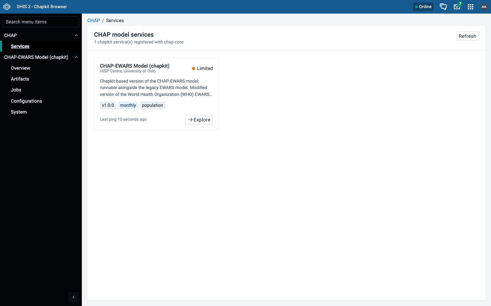
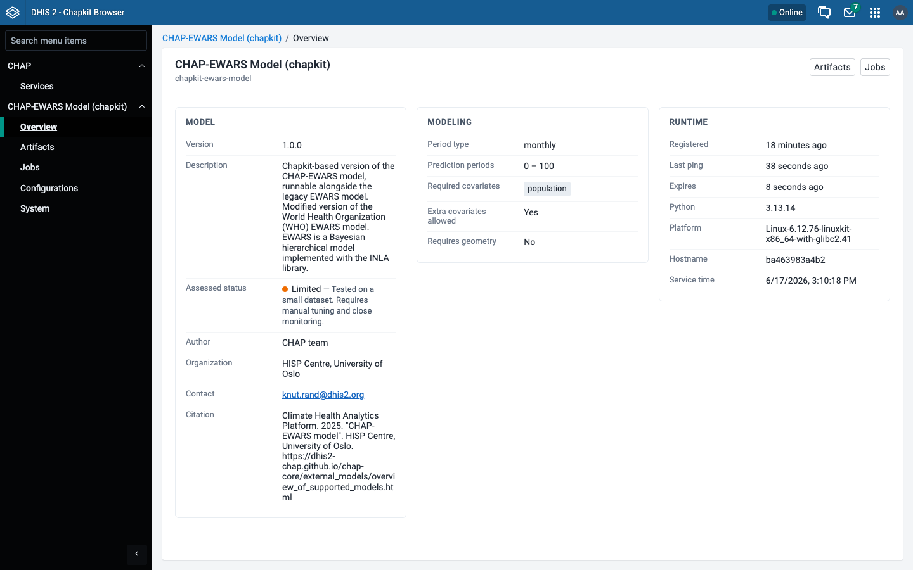
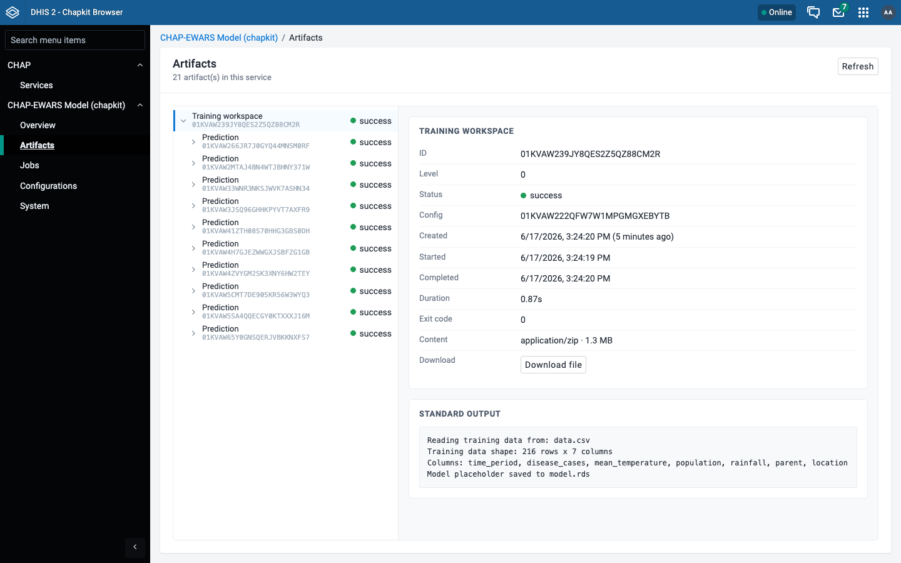
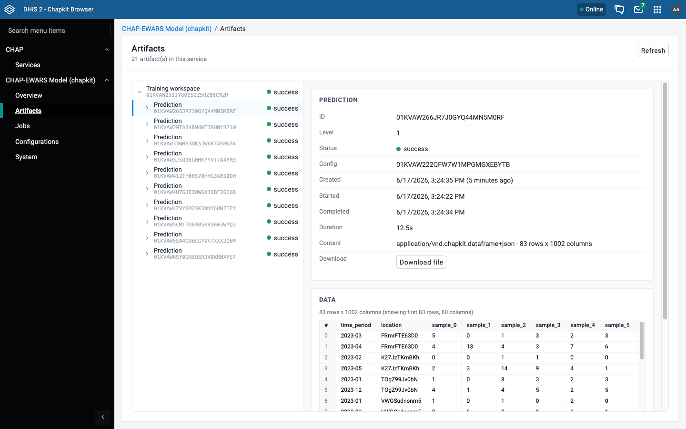
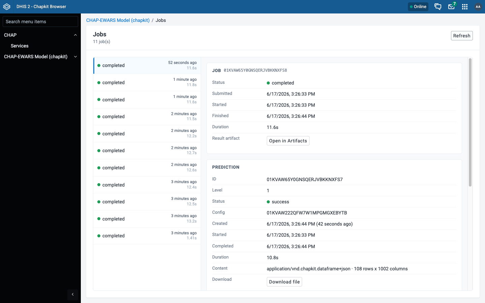
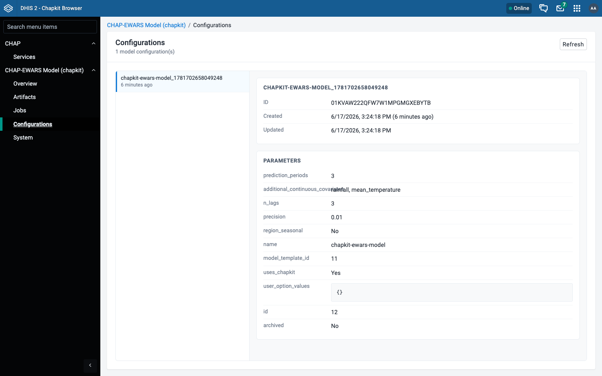
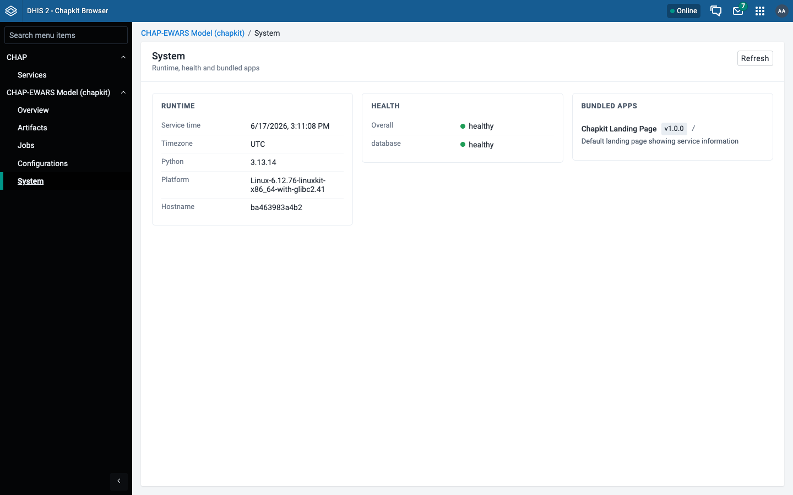
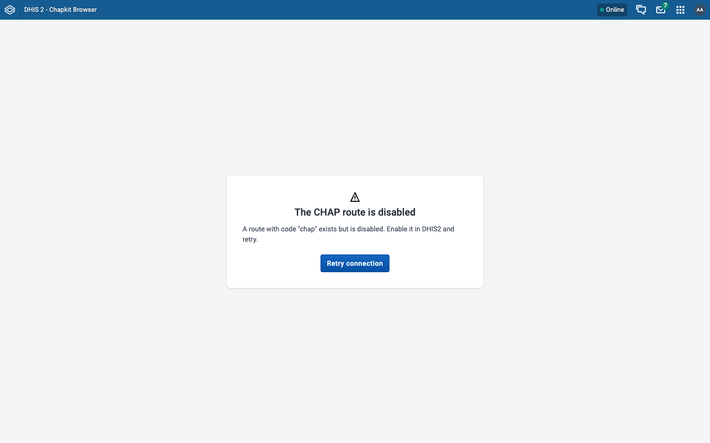

# Screens

A walkthrough of every page in the Chapkit Browser. Screenshots were taken against a local DHIS2 instance wired to chap-core with the CHAP-EWARS chapkit model registered.

## Services

The landing page. Lists every chapkit model service registered with chap-core as a card, showing its display name, version, period type, required covariates, and registration status. Use **Explore** to drill into a service.

{ loading=lazy }

## Service overview

Detailed view for a single service, split into three columns:

- **Model** - version, description, author, organization, contact, citation, repository, and documentation links.
- **Modeling** - period type, prediction periods, required and extra covariates, geometry requirements.
- **Runtime** - registration time, last ping, expiry, Python version, platform, hostname, and service time.

{ loading=lazy }

## Artifacts

Model artifacts produced by the service - the outputs of evaluations and predictions, arranged as a hierarchy (a training workspace at level 0 with the prediction artifacts beneath it). Selecting an artifact shows its metadata, status, content type and size, the captured stdout, and a download link.

{ loading=lazy }

Dataframe artifacts (content type `application/vnd.chapkit.dataframe+json`) are previewed inline as a table - here a prediction result with its rows and columns rendered directly in the browser.

{ loading=lazy }

## Jobs

The service's jobs and executions, with status and timing for each run.

{ loading=lazy }

## Configurations

The configurations registered with the service.

{ loading=lazy }

## System

System-level information and diagnostics reported by the service.

{ loading=lazy }

## Connection setup

When no DHIS2 route with code `chap` exists, or chap-core cannot be reached through it, the app shows a setup screen explaining exactly what to fix instead of failing silently.

{ loading=lazy }
